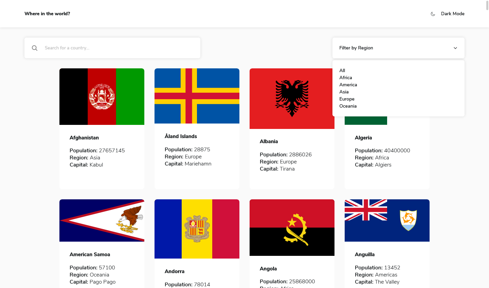
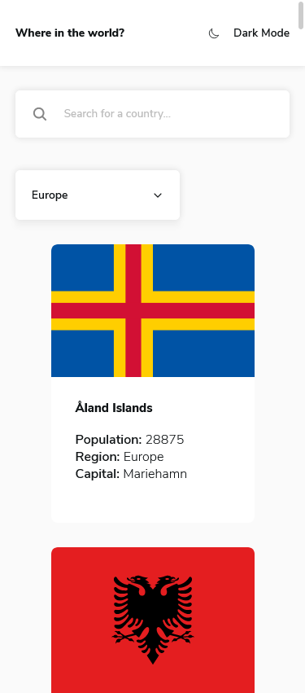
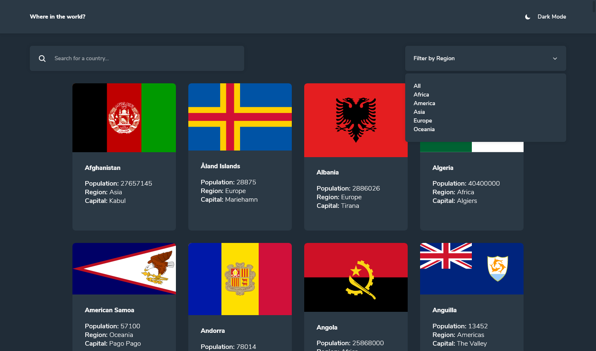
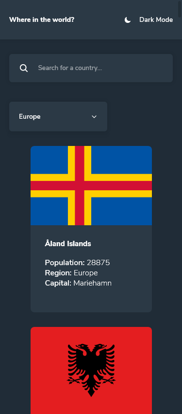
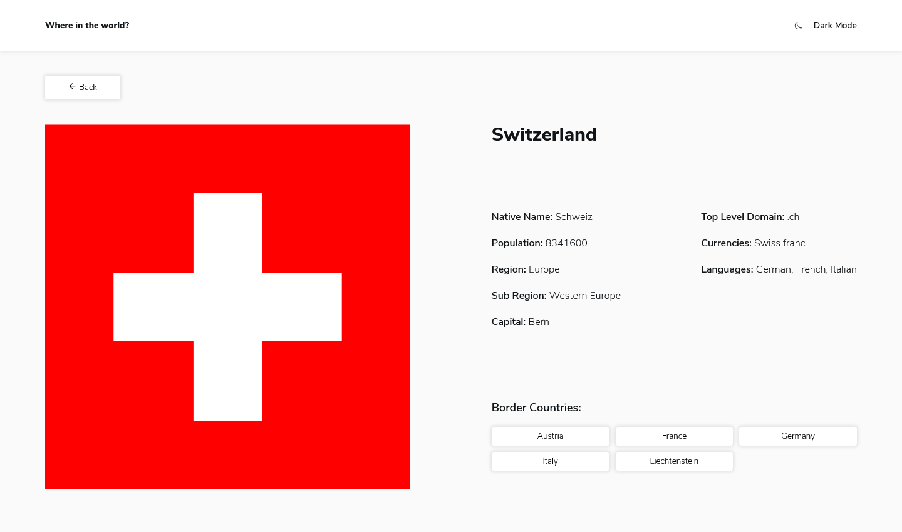
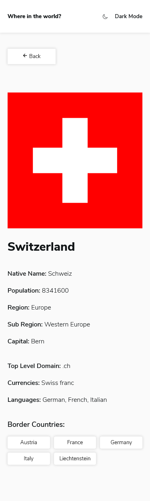
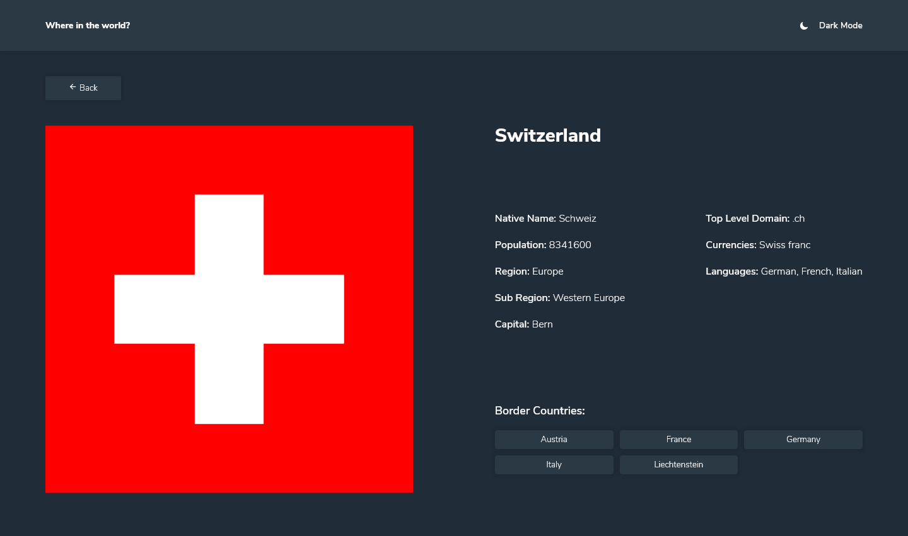
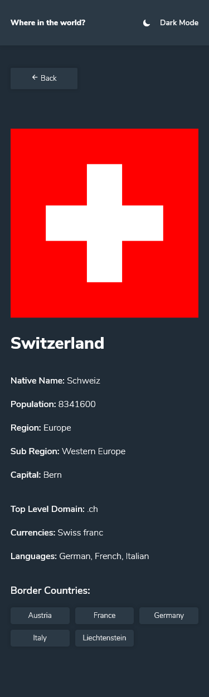

# Frontend Mentor - REST Countries API with color theme switcher solution

This is a solution to the [REST Countries API with color theme switcher challenge on Frontend Mentor](https://www.frontendmentor.io/challenges/rest-countries-api-with-color-theme-switcher-5cacc469fec04111f7b848ca). Frontend Mentor challenges help you improve your coding skills by building realistic projects. 

## Table of contents

- [Overview](#overview)
  - [The challenge](#the-challenge)
  - [Screenshot](#screenshot)
  - [Links](#links)
- [My process](#my-process)
  - [Built with](#built-with)
  - [What I learned](#what-i-learned)
  - [Continued development](#continued-development)
- [Author](#author)

## Overview

### The challenge

Users should be able to:

- See all countries from the API on the homepage
- Search for a country using an `input` field
- Filter countries by region
- Click on a country to see more detailed information on a separate page
- Click through to the border countries on the detail page
- Toggle the color scheme between light and dark mode *(optional)*

### Screenshots

### Links

- Live Site URL: [GitHub Pages](https://tobomuto.github.io/backstagetalks-clone/)

### Built with

- [Vue.js3](https://vuejs.org/) - JS library
- [VueX](https://vuex.vuejs.org/)
- SCSS
- Flexbox
- CSS Grid
- Mobile-first workflow
- Axios to fetch the data from the API

### What I learned

- I'm used to Vue.js 2. I wanted to try vue3 and VueX that I've never used.
- My first try making a dark mode. I used class binding for that.

### Continued development

- I may add some animation from gsap to make the app more fun.

## Author

- Website - [Thomas Bouvier](https://tombvr.fr)
- Frontend Mentor - [@tobomuto](https://www.frontendmentor.io/profile/tobomuto)